# 1.mac安装

官网下载：https://www.python.org/downloads/macos/

```bash
# 查看版本
python3 --version
# 进入python解释器
python3
```

# 2.hello world

```python
# 进入python解释器
python3
# 输出hello world
print("hello world")
```

# 3.执行python文件

test.py 文件：

```python
print("11")
print("22")
```

在终端执行文件：

```bash
python3 ~/Documents/test.py
```

# 4.编辑器

JetBrains 的 **PyCharm**

# 5.数据类型

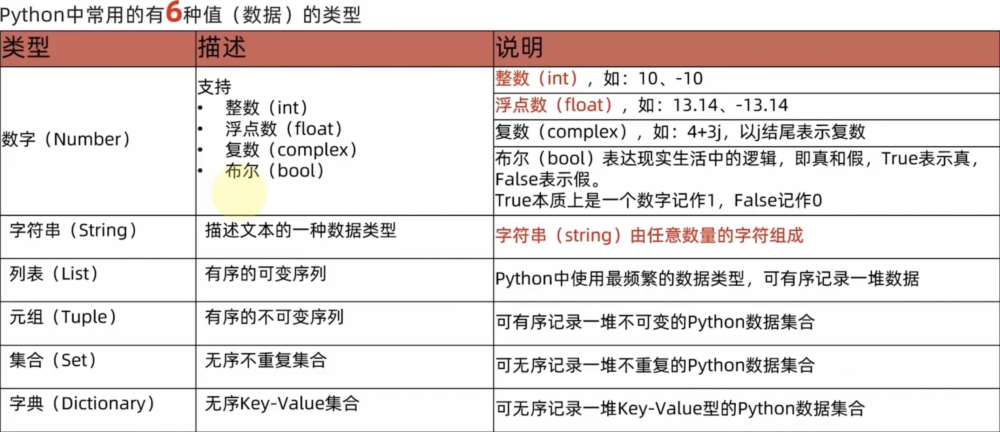

```python
print(11)
print(11.22)
print("hello world")
```

# 6.变量

```python
money = 50
print(money)
money -= 10
print("money - 10 =", money)
```

# 7.查看数据类型：type()

```python
aType = type(11)
bType = type(11.22)
cType = type("hello world")
print(aType) # <class 'int'>
print(bType) # <class 'float'>
print(cType) # <class 'str'>
```

# 8.数据类型的转换

常见的转换语句

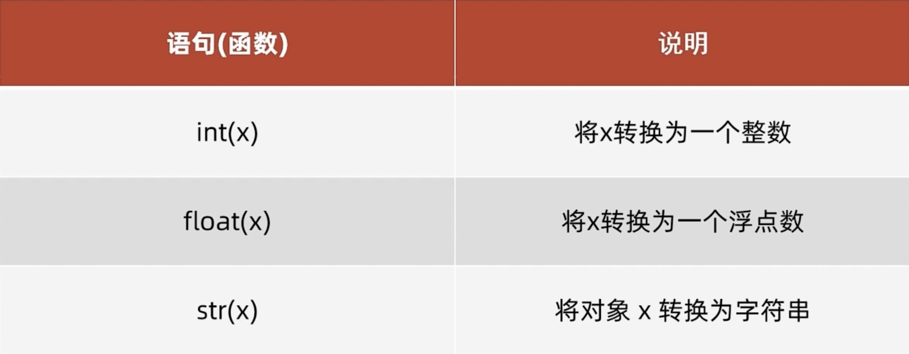

```python
strToInt = int("111")
print(strToInt, type(strToInt)) # 111 <class 'int'>
strToFloat = float("111.12")
print(strToFloat, type(strToFloat)) # <class 'int'>
toStr = str(123)
print(toStr, type(toStr)) # 123 <class 'str'>
```

# 9.运算符

## 算术运算符

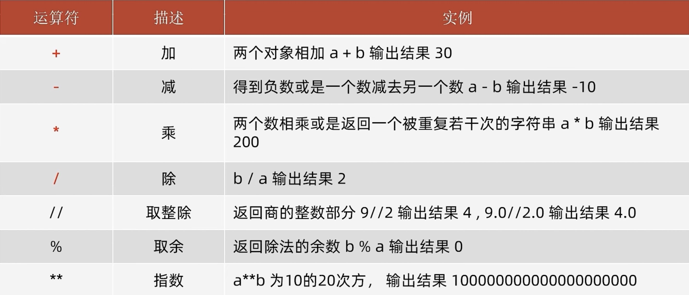

```python
print("1 + 1 = ", 1 + 1)
print("2 - 1 = ", 2 - 1)
print("3 * 3 = ", 3 * 3)
print("4 / 2 = ", 4 / 2)
print("11 // 2 = ", 11 // 2) # 11 整除 2
print("9 % 2 = ", 9 % 2) # 9 取余 2
print("2 ** 2 = ", 2 ** 2) # 2 的 2次方
```

## 赋值运算符

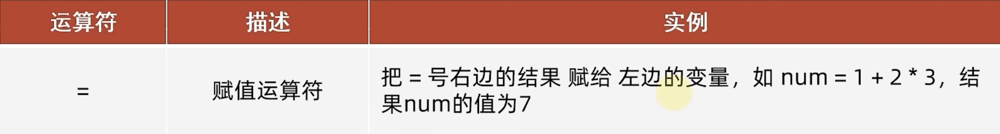

## 复合赋值运算符

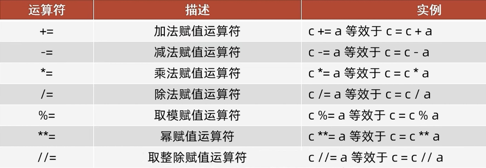

# 10.字符串扩展

## 字符串的三种定义方式

```python
name1 = 'zhangsan'
name2 = "zhangsan"
name3 = """
    zhangsan
    lisi
"""
print(name1, name2, name3)
```

## 字符串格式化

### 占位符

```python
name1 = "zhangsan"
name2 = "lisi"
name3 = "wangwu"
print(name1 + " " + name2) # zhangsan lisi
print("zhangsan %s" % name2) # zhangsan lisi
print("zhangsan %s %s" % (name2, name3)) # zhangsan lisi wangwu
```

python 中支持非常多的数据类型占位

最常用的是如下三类：

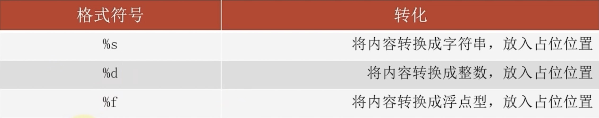

- %5d：表示将整数的宽度控制在5位，如数字11，被设置为5d，就会变成：`   11`，用三个控制补足宽度。
- %5.2f：表示将宽度控制为5，将小数精度设置为2
- %.2f：表示不限制宽度，只设置小数点精度为2，如`11.345`设置后，结果是`11.35`

### 数字精度控制

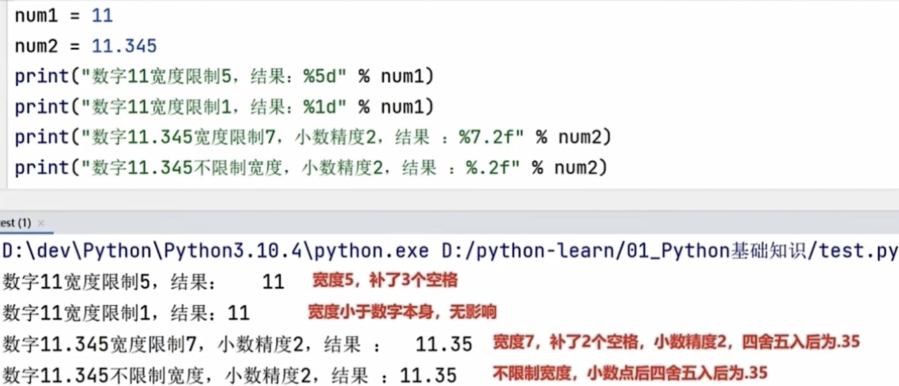

```python
num1 = 11
num2 = 11.345
print("数字11宽度限制5，结果：%5d" % num1) # 数字11宽度限制5，结果：   11
print("数字11宽度限制1，结果：%1d" % num1) # 数字11宽度限制1，结果：11
print("数字11.345宽度限制7，小数精度2，结果：%7.2f" % num2) # 数字11.345宽度限制7，小数精度2，结果：  11.35
print("数字11.345不限制宽度，小数精度2，结果：%.2f" % num2) # 数字11.345不限制宽度，小数精度2，结果：11.35
```

### 快速格式化

通过语法：`f"内容{变量}"`的格式来快速格式化

```python
name = "zhangsan"
age = 18
print(f"名称：{name}，年龄：{age}") # 名称：zhangsan，年龄：18
```

# 11.数据输入

掌握input语句（函数）的使用

```python
inputValue = input("请输入：")
print("输入的值：", inputValue)
```

# 12.判断语句

## 布尔类型的定义

布尔类型的字面量：

- True 表示真（是、肯定）
- False 表示假（否、否定）

```python
bool = True
print(bool, type(bool)) # True <class 'bool'>
print(1 == 1) # True
```

## 比较运算符

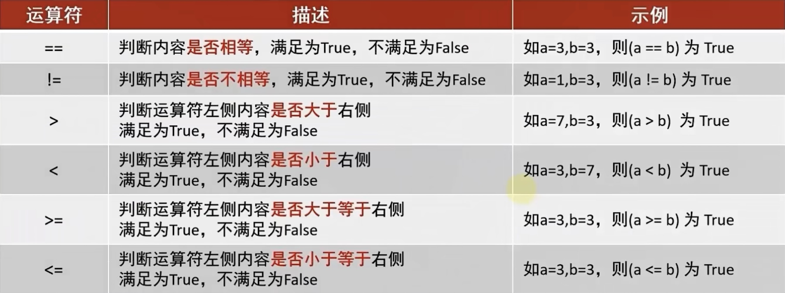

not: 取反

```python
name = 1
print("取反", not name)
```

## if判断语句

```python
age = 18
if age >= 18:
    print("if 执行内容")
    print("年龄大于等于18")
elif age >= 20:
    print("elif 执行内容")
    print("年龄大于等于20")
else:
    print("else 执行内容")
    print("年龄小于18")
print("不在if语句内")
```

# 13.循环语句

## while循环语句

```python
i = 0
while i < 10:
    print(i, end=" ") # 0 1 2 3 4 5 6 7 8 9
    i += 1
```

## for循环语句

```python
targetStr = "abcd"
for item in targetStr:
    print(item, end=" ") # a b c d
```

## range语句

```python
# range(end): 获取从 0 到 end 之间的数（不包括end）
for item in range(5):
    print(item, end=" ") # 0 1 2 3 4
print()
# range(start, end): 获取从 start 到 end 之间的数（不包括end）
for item in range(5, 10):
    print(item, end=" ") # 5 6 7 8 9
print()
# range(start, end, step): 获取从 start 到 end 之间的数（不包括end），每个数之间步长为 step
for item in range(5, 10, 2):
    print(item, end=" ") # 5 7 9
print()
```

## break和continue

```python
for item in range(10):
    if item % 2 == 0: # 如果是偶数，则跳过此次循环
        continue
    elif item > 5: # 如果大于5，则跳出循环
        break
    print(item, end=" ") # 1 3 5
```

# 14.函数

## 内置函数

- print(): 控制台输出
- input(): 控制台输入
- int(): 转整数
- float(): 转浮点数
- str(): 转字符串
- len(): 获取字符串长度

```python
# len(): 获取字符串长度
name = "zhangsan"
print(len(name)) # 8
```

## 定义函数

```python
# 定义函数，获取字符串长度
def get_len(str):
    length = 0
    for i in str:
        length += 1
    return length
# 调用函数
print(get_len("zhangsan")) # 8
```

## None类型

None表示：空的、无实际意义的意思

```python
# None类型
def fn():
    print("无返回值")
result = fn()
print(result) # None
print(type(result)) # <class 'NoneType'>
print(result is None) # True
# None 在条件判断中为 False
print(not not result) # False
```

## 函数的说明文档

```python
def sum(x, y):
    """
    计算两数之和
    :param x: 数字1
    :param y: 数字2
    :return: 两数之和
    """
    return x + y
print(sum(1, 2)) # 3
```

## global关键字

```python
num1 = 10
num2 = 100
def fn3():
    num1 = 20 # 局部变量
    global num2 # 全局变量
    num2 = 200
    print("函数内", num1, num2) # 函数内 20 200
fn3()
print("函数外", num1, num2) # 函数外 10 200
```

# 15.数据容器

## list(列表)

**一批数据、可修改、可重复的存储场景**

可以容纳多个元素（上限为 2**63-1、9223372036854775807个）

定义

```python
list1 = list()
list2 = []
list3 = ["zhangsan", 18, True, [1, 2, 3]]
print(list1, list2, list3) # [] [] ['zhangsan', 18, True, [1, 2, 3]]
print(type(list3)) # <class 'list'>
print(len(list3)) # 4
print(list3[0]) # zhangsan
print(list3[3][0]) # 1
print(list3[-1]) # [1, 2, 3]
print(list3[-2]) # True
```

操作

```python
list = ["zhangsan", [1, 2, 3]]
# 清空列表
list.clear()
print(list) # []
# 获取指定内容的下标，找不到会报错
list = ["zhangsan", [1, 2, 3]]
print(list.index("zhangsan")) # 0
print(list.index([1, 2, 3])) # 1
# 修改元素
list[0] = "lisi"
print(list) # ['lisi', [1, 2, 3]]
# 在指定下标插入元素
list.insert(0, "zhangsan")
print(list) # ['zhangsan', 'lisi', [1, 2, 3]]
# 在列表尾部追加单个元素
list.append("zhangsan")
print(list) # ['zhangsan', 'lisi', [1, 2, 3], 'zhangsan']
# 在列表尾部追加多个元素
list.extend([1, 2])
print(list) # ['zhangsan', 'lisi', [1, 2, 3], 'zhangsan', 1, 2]
# 删除元素
del list[1]
print(list) # ['zhangsan', [1, 2, 3], 'zhangsan', 1, 2]
print(list.pop(1)) # [1, 2, 3]
print(list) # ['zhangsan', 'zhangsan', 1, 2]
list.remove("zhangsan")
print(list) # ['zhangsan', 1, 2]
# 统计 'zhangsan' 在列表中有几个
print(list.count("zhangsan")) # 1
```

遍历

```python
list = [1, 2, 3, 4, 5, 6]
# while循环
i = 0
while i < len(list):
    print(list[i], end=" ") # 1 2 3 4 5 6
    i += 1
print()
# for循环
for item in list:
    print(item, end=" ") # 1 2 3 4 5 6
print()
```

## tuple(元组)

**一批数据、不可修改、可重复的存储场景**

与集合不同的是：元组一旦定义完成，就不可修改

定义

```python
tuple1 = tuple()
tuple2 = ()
tuple3 = ("zhangsan", 18, True, (1, 2, 3))
tuple4 = ("zhangsan", ) # 如果元组只有一个数据，需要在后面加逗号
print(tuple1, tuple2, tuple3, tuple4) # () () ('zhangsan', 18, True, (1, 2, 3)) ('zhangsan',)
print(type(tuple3)) # <class 'tuple'>
print(len(tuple3)) # 4
print(tuple3[0]) # zhangsan
print(tuple3[3][0]) # 1
print(tuple3[-1]) # (1, 2, 3)
print(tuple3[-2]) # True
```

操作

```python
tupleList = ("zhangsan", (1, 2, 3))
# 获取指定内容的下标，找不到会报错
print(tupleList.index("zhangsan")) # 0
print(tupleList.index((1, 2, 3))) # 1
# 统计 'zhangsan' 在列表中有几个
print(tupleList.count("zhangsan")) # 1
```

遍历

```python
tupleList = (1, 2, 3, 4, 5, 6)
# while循环
i = 0
while i < len(tupleList):
    print(tupleList[i], end=" ") # 1 2 3 4 5 6
    i += 1
print()
# for循环
for item in tupleList:
    print(item, end=" ") # 1 2 3 4 5 6
print()
```

## str(字符串)

**一串字符串的存储场景**

定义

```python
str = "zhangsan"
print(len(str)) # 8
print(str[0]) # z
print(str[-1]) # n
print(str[-2]) # a
```

操作

```python
str = "zhangsan lisi"
# 获取指定内容的下标，找不到会报错
print(str.index("lisi")) # 9
# 统计 'an' 在列表中有几个
print(str.count("an")) # 2
# 将lisi替换成wangwu
str = str.replace("lisi", "wangwu")
print(str) # zhangsan wangwu
# 按照指定的分隔符转换为list
list = str.split(" ")
print(list, type(list)) # ['zhangsan', 'wangwu'] <class 'list'>
# 去除前后空格以及回车符
str = "  zhangsan  "
str = str.strip()
print(str) # zhangsan
# 去除前后指定的字符串
str = "11zhangsan11"
str = str.strip("11")
print(str) # zhangsan
```

遍历

```python
str = "zhangsan"
# while循环
i = 0
while i < len(str):
    print(str[i], end=" ") # z h a n g s a n
    i += 1
print()
# for循环
for item in str:
    print(item, end=" ") # z h a n g s a n
print()
```

## 序列的切片

列表、元组、字符串都属于序列，可进行切片操作

语法：`序列[start:end:step]`，类似range语句

- 从 start 到 end 切片（不包括end），每个项之间步长为 step
- 三个参数都可为空
- start 不写默认从头开始
- end 不写默认到尾结束
- step 不写默认 1

```python
list = [1, 2, 3, 4, 5, 6, 7, 8, 9]
# 从 0 到 5 切片（不包括5）
print(list[0:5]) # [1, 2, 3, 4, 5]
# 全部省略不写，表示从头到尾切片
print(list[:]) # [1, 2, 3, 4, 5, 6, 7, 8, 9]
# 从头到尾切片，步长 2
print(list[::2]) # [1, 3, 5, 7, 9]
# 从尾到头切片
print(list[::-1]) # [9, 8, 7, 6, 5, 4, 3, 2, 1]
# 从 3 到 1 切片（不包括1），步长必须 -1
print(list[3:1:-1]) # [4, 3]
```

## set(集合)

**一批数据，去重存储场景**

无序，不可重复

定义

```python
set1 = set()
set2 = {"zhangsan", "lisi"}
print(set1, set2) # set() {'zhangsan', 'lisi'}
print(type(set2)) # <class 'set'>
print(len(set2)) # 2
```

操作

```python
mySet = {"zhangsan", "lisi"}
# 清空集合
mySet.clear()
print(mySet) # set()
# 添加元素
mySet = {"zhangsan", "lisi"}
mySet.add("zhangsan")
mySet.add("wangwu")
print(mySet) # {'zhangsan', 'lisi', 'wangwu'}
# 删除元素
mySet.remove("wangwu")
print(mySet) # {'zhangsan', 'lisi'}
# 随机取出元素
print(mySet.pop()) # lisi
print(mySet) # {'zhangsan'}
# 取出 set1 和 set2 的差集（set1 有而 set2 没有的）
set1 = {1, 2, 3}
set2 = {1, 4, 5}
print(set1.difference(set2)) # {2, 3}
print(set1) # {1, 2, 3}
print(set2) # {1, 4, 5}
# 删除 set1 在 set2 中存在的元素
set1 = {1, 2, 3}
set2 = {1, 4, 5}
set1.difference_update(set2)
print(set1) # {2, 3}
print(set2) # {1, 4, 5}
# 将 set1 和 set2 合并
set1 = {1, 2, 3}
set2 = {1, 4, 5}
print(set1.union(set2)) # {1, 2, 3, 4, 5}
print(set1) # {1, 2, 3}
print(set2) # {1, 4, 5}
```

遍历

```python
mySet = {1, 2, 3, 4, 5, 6}
# for循环
for item in mySet:
    print(item, end=" ") # 1 2 3 4 5 6
print()
```

## dict(字典、映射)

**一批数据，可用 key 检索 value 的存储场景**

定义

```python
dict1 = dict()
dict2 = {}
dict3 = {
    "name": "zhangsan",
    "age": 18,
    11: "123"
}
print(dict1, dict2, dict3) # {} {'name': 'zhangsan', 'age': 18}
print(type(dict3)) # <class 'dict'>
print(len(dict3)) # 2
print(dict3["name"]) # zhangsan
print(dict3[11]) # 123
```

操作

```python
myDict = {
    "name": "zhangsan",
    "age": 18,
}
# 清空字典
myDict.clear()
print(myDict) # {}
# 新增元素
myDict = {
    "name": "zhangsan",
    "age": 18,
}
myDict["gender"] = "男"
print(myDict) # {'name': 'zhangsan', 'age': 18, 'gender': '男'}
# 更新元素
myDict["name"] = "lisi"
print(myDict) # {'name': 'lisi', 'age': 18, 'gender': '男'}
# 删除元素
del myDict["gender"]
print(myDict) # {'name': 'lisi', 'age': 18}
print(myDict.pop("age")) # 男
print(myDict) # {'name': 'lisi'}
# 获取全部 key
myDict = {
    "name": "zhangsan",
    "age": 18,
}
dictKeys = myDict.keys()
print(dictKeys, type(dictKeys)) # dict_keys(['name', 'age']) <class 'dict_keys'>
```

遍历

```python
myDict = {
    "name": "zhangsan",
    "age": 18,
}
# for循环
for item in myDict:
    print(f"{item}:{myDict[item]}", end=" ") # name:zhangsan age:18
print()
```

## 数据容器特点对比

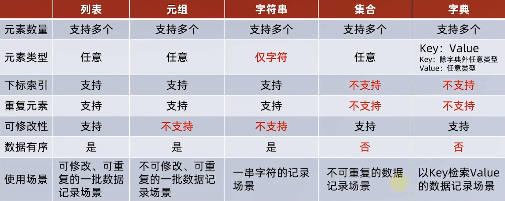

## 数据容器的通用操作

### 遍历

- 5类数据容器都支持 for 循环遍历
- 列表、元组、字符串支持 while 循环，集合、字典不支持（无法下标索引）

### 统计

- len(容器): 统计容器的元素个数
- max(容器): 统计容器的最大元素
- min(容器): 统计容器的最小元素

### 转换

- list(容器): 将给定容器转换为列表
- tuple(容器): 将给定容器转换为列表
- str(容器): 将给定容器转换为字符串
- set(容器): 将给定容器转换为集合

### 排序

- sorted(容器): 将给定容器进行升序，并转换为列表返回
- sorted(容器, reverse=True): 将给定容器进行降序，并转换为列表返回

# 16.函数进阶

## 函数多返回值

```python
def fn1():
    return "zhangsan", 18
name, age = fn1()
print(name, age) # zhangsan 18
```

## 函数多种传参方式

```python
def fn2(name, age, gender):
    print(f"name:{name}, age:{age}, gender:{gender}")
# 位置传参
fn2("zhangsan", 18, "male") # name:zhangsan, age:18, gender:male
# 关键字传参，可以不按照固定顺序
fn2(age=18, name="zhangsan", gender="male") # name:zhangsan, age:18, gender:male
# 可以和位置参数混用，位置参数必须在前
fn2("zhangsan", age=18, gender="male") # name:zhangsan, age:18, gender:male

# 位置传参不定长
def fn3(*args):
    print(args)
fn3("zhagnsan", 18, "male") # ('zhagnsan', 18, 'male')

# 关键字传参不定长
def fn3(**args):
    print(args)
fn3(name="zhagnsan", age=18, gender="male") # {'name': 'zhagnsan', 'age': 18, 'gender': 'male'}
```

## 匿名函数

lambda匿名函数

- def关键字，可以定义带有名称的函数
- lambda关键字，可以定义匿名函数（无名称）

有名称的函数，可以基于名称重复使用。

无名称的匿名函数，只可临时使用一次。

语法：`lambda 参数: 函数体(一行代码)`

```python
def fn4(compute):
    result = compute(1, 2)
    print(result)
# 将函数作为参数需要先定义一个函数
def compute(x, y):
    return x + y
fn4(compute)
# 可用匿名函数减少代码量（只能写一行代码）
fn4(lambda x, y: x + y)
```

# 17.文件操作

open(name, mode, encoding): 打开文件

- name: 要打开的目标文件名（可以包含文件路径）
- mode: 设置打开文件的模式：r:只读、w:写入、a:追加
- encoding: 编码格式（推荐使用 utf-8）

mode的访问模式

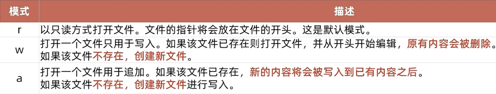

## 文件的读取

```python
# 打开 a.txt 文件，如果没有会报错
f = open("files/a.txt", "r", encoding="utf-8")
print(type(f)) # <class '_io.TextIOWrapper'>
# 关闭文件
f.close()

print("****************** 读取全部内容 ******************")

# 读取全部内容
f = open("files/a.txt", "r", encoding="utf-8")
print(f.read()) # aaa\n
                # bbb\n
                # ccc
f.close()

print("****************** 只读取2个字节 ******************")

# 只读取4个字节
f = open("files/a.txt", "r", encoding="utf-8")
print(f.read(4), end="") # aaa\n
print(f.read(4), end="") # bbb\n
f.close()

print("****************** 读取一行 ******************")

# 读取一行
f = open("files/a.txt", "r", encoding="utf-8")
print(f.readline(), end="") # aaa\n
print(f.readline(), end="") # bbb\n
f.close()

print("****************** 读取全部行 ******************")

# 读取全部行
f = open("files/a.txt", "r", encoding="utf-8")
print(f.readlines()) # ['aaa\n', 'bbb\n', 'ccc']
f.close()

print("****************** 循环读取每一行 ******************")

# 循环读取每一行
f = open("files/a.txt", "r", encoding="utf-8")
for line in f:
    print(line, end="") # aaa\n
                        # bbb\n
                        # ccc
print()
f.close()

print("****************** with open 语法操作文件 ******************")

# with open 语法操作文件
with open("files/a.txt", "r", encoding="utf-8") as f:
    for line in f:
        print(line, end="")  # aaa\n
                             # bbb\n
                             # ccc
    print()
    # f.close() # 会自动关闭
```

## 文件的写入

注意：

- 直接调用 write，内容并未真正写入文件，而是会积攒在程序的内存中，称之为缓冲区
- 当调用 flush 的时候，内容会真正写入文件
- 这样做是避免频繁的操作硬盘，导致效率下降（攒一堆，一次性写磁盘）

```python
# 打开一个空的 b.txt 文件，如果没有：会创建文件，如果有：会清空文件内容
f = open("files/b.txt", "w", encoding="utf-8")

# 写入内容
f.write('hello world')

# 刷新内容（保存）
# f.flush()

# 关闭文件，close 内置了 flush 的功能
f.close()
```

## 文件的追加

```python
# 打开 c.txt 文件，如果没有：会创建文件
f = open("files/c.txt", "a", encoding="utf-8")

# 追加内容
f.write('hello world\n')

# 刷新内容（保存）
# f.flush()

# 关闭文件，close 内置了 flush 的功能
f.close()
```

# 18.异常、模块与包

## 异常

```python
# FileNotFoundError: 没有这样的文件或目录：'files/d.txt'
f = ''
try:
    f = open("files/d.txt", "r", encoding="utf-8")
except FileNotFoundError as e:
    print(e) # [Errno 2] No such file or directory: 'files/d.txt'
    print('文件 d.txt 不存在，改为 w 模式去打开')
    f = open("files/d.txt", "w", encoding="utf-8")
f.close()

# NameError: 名称为 'a' 的变量未定义
try:
    print(a)
except NameError as e:
    print(e) # name 'a' is not defined

# ZeroDivisionError: 除零，算式错误
try:
    print(1 / 0)
except ZeroDivisionError as e:
    print(e) # division by zero

print("****************** 捕获多个异常 ******************")

# 异常1, 异常2, ...
try:
    print(a)
    print(1 / 0)
except (NameError, ZeroDivisionError) as e:
    print(e)

print("****************** 捕获所有异常 ******************")

# Exception: 所有异常
try:
    print(a)
    print(1 / 0)
except Exception as e:
    print(e)

print("****************** else 和 finally ******************")

# NameError: 名称为 'a' 的变量未定义
try:
    print('111')
    # print(a)
except NameError as e:
    print(e)
else:
    # 没有异常才会执行
    print('没有异常')
finally:
    # 有没有异常都执行
    print('有没有异常都执行')
```

## 模块

模块（Module）就是一个 Python 文件，里面有类、函数、变量等、我们可以拿过来用（导入模块去使用）

### 模块的导入

语法：`[form 模块名] import [模块 | 类 | 变量 | 函数 | *] [as 别名]`

常用的组合形式如：

- import 模块名
- from 模块名 import 类、变量、方法等
- from 模块名 import *
- import 模块名 as 别名
- from 模块名 import 功能名 as 别名

```python
# 导入 time 模块
import time
print('开始')
time.sleep(1) # 让程序睡眠 1 秒（阻塞）
print('结束')

# 导入 time 模块中的 sleep
from time import sleep
print('开始2')
sleep(1) # 直接写 sleep
print('结束2')

# 导入 time 模块中的全部功能
from time import *
print('开始3')
sleep(1) # 直接写 sleep
print('结束3')

print("****************** as 起别名 ******************")

# 模块别名
import time as t
print('开始4')
t.sleep(1)
print('结束4')

# 功能别名
from time import sleep as sl
print('开始5')
sl(1)
print('结束5')
```

### 自定义模块

```python
import GlobalUtils
# 调用自定义 sum() 方法
print(GlobalUtils.sum(10, 20)) # 30

from GlobalUtils import *
fn1()
# fn2() # 未导入进来
```

GlobalUtils.py 文件：

```python
# 设置在使用 'from GlobalUtils import *' 导入时，只能导入 __all__ 中定义的元素
__all__ = ['sum', 'fn1']

# 求和
def sum(num1, num2):
    return num1 + num2

# 方法1
def fn1():
    print('fn1')

# 方法2
def fn2():
    print('fn2')

# python 的内置变量 __main__，当运行本模块时它的值为 '__main__'，反之被其他模块导入时它的值为本模块名 'GlobalUtils'
# 这样判断就可以实现运行本模块做测试
if __name__ == '__main__':
    print(sum(1, 2))
    fn1()
    fn2()
```

## 包

从物理上看，包就是一个文件夹，在该文件夹下包含了一个 \__init__.py 文件，该文件夹可用于包含多个模块文件

从逻辑上看，包的本质依然是模块

### 自定义包

结构：

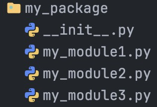

```python
# 导入包中的模块
import my_package.my_module1
import my_package.my_module2
my_package.my_module1.fn1()
my_package.my_module2.fn2()

# 导入包中的模块中的功能
from my_package.my_module1 import fn1
from my_package.my_module2 import fn2
fn1()
fn2()

# 导入包中的所有模块
from my_package import *
my_package.my_module1.fn1()
# my_package.my_module3.fn3() # 未导入进来
```

\__init__.py 文件：

```python
# 在使用 'from my_package import *' 导入时，只能导入 __all__ 中定义的元素
__all__ = ['my_module1', 'my_module2']
```

my_module1.py 文件：

```python
def fn1():
    print('fn1')
```

my_module2.py 文件：

```python
def fn2():
    print('fn2')
```

my_module3.py 文件：

```python
def fn3():
    print('fn3')
```

### 安装第三方包

在 Python 程序的生态中，有许多非常多的第三方包（非 Python 官方），可以极大的帮助我们提高开发效率，如：

- 科学计算中常用的：numpy
- 数据分析中常用的：pandas
- 大数据计算中常用的：pyspark、apache-flink
- 图形可视化常用的：matplotlib、pyecharts
- 人工智能常用的：tensorflow

第三方包的安装非常简单，我们只需要使用 Python 内置的 pip 程序即可。

```bash
# 查看 pip 的版本
python3 -m pip --version
# 安装 numpy 包
pip3 install numpy
# 安装 numpy 包，用国内网址安装
pip3 install -i https://pypi.tuna.tsinghua.edu.cn/simple numpy
```

https://pypi.tuna.tsinghua.edu.cn/simple 是清华大学提供的一个网站，可供 pip 程序下载第三方包

# 19.json

```python
import json

# 准备一个符合 json 格式的数据
data = [
    {
        "name": "zhangsan",
        "age": 18
    },
    {
        "name": "list",
        "age": 19
    }
]

# python数据 转 json字符串
jsonStr = json.dumps(data)
print(type(jsonStr)) # <class 'str'>
print(jsonStr) # [{"name": "zhangsan", "age": 18}, {"name": "list", "age": 19}]

# json字符串 转 python数据
array = json.loads(jsonStr)
print(type(array)) # <class 'list'>
print(array) # [{'name': 'zhangsan', 'age': 18}, {'name': 'list', 'age': 19}]
```

# 20.PyEcharts(数据可视化)

Echarts 框架的 Python 版本。

安装：

```bash
pip install pyecharts
```

官方画廊：https://gallery.pyecharts.org/#/

# 21.面向对象

## 初识对象

```python
# 学生类
class Student:
    # 成员变量
    name = None
    gender = None
    age = None
    # 私有成员变量，命名以__(两个下划线开头)，其他与java一样。
    __id = '001'

    # 构造方法，self就是this，只能定义一个
    def __init__(self, name, gender, age):
        self.name = name
        self.gender = gender
        self.age = age

    # 成员方法，self就是this，传参的时候可以当它不存在
    def say_hi(self, name):
        self.name = name
        print(f'Hi大家好，我是{self.name}')

    # 私有成员方法，命名以__(两个下划线开头)，其他与java一样。
    def __private_fn(self):
        print('我是私有成员方法')

    # 访问私有成员
    def visit_private_members(self):
        print(f'id是{self.__id}')
        self.__private_fn()


# 创建对象
student = Student('zhangsan', '男', 18)
print('name', student.name)
print('gender', student.gender)
print('age', student.age)
print()

# 对象属性赋值
student.name = 'list'
student.gender = '男'
student.age = 21
print('name', student.name)
print('gender', student.gender)
print('age', student.age)
print()

# 调用 say_hi
student.say_hi('zhangsan')
# 调用 visit_private_members
student.visit_private_members()
```

## 魔术方法

魔术方法就是类的内置方法，`__init__`就是内置方法之一。

- `__init__`：构造方法，创建对象时自动调用
- `__str__`：转字符串方法，打印对象时自动调用
- `__eq__`：等于方法，==时自动调用，且!=时也会调用
- `__lt__`：小于方法，<时自动调用，且>时也会调用
- `__le__`：小于等于方法，<=时自动调用，且>=时也会调用
- `__gt__`：大于方法，>时自动调用，且<时也会调用
- `__ge__`：大于等于方法，>=时自动调用，且<=时也会调用

比较方法只需要定义`__eq__`、`__lt__`、`__le__`就能进行所有的比较(==、<、<=、>、>=)

```python
# 学生类
class Student:
    # 成员变量
    name = None
    gender = None
    age = None

    def __init__(self, name, gender, age):
        self.name = name
        self.gender = gender
        self.age = age

    # 定义转字符串方法，这个就是toString
    def __str__(self):
        return f'{self.name} {self.gender} {self.age}'

    # 定义等于方法，==时自动调用，且!=时也会调用
    def __eq__(self, other):
        return self.age == other.age

    # 定义小于方法，<时自动调用，且>时也会调用
    def __lt__(self, other):
        return self.age < other.age

    # 定义小于等于方法，<=时自动调用，且>=时也会调用
    def __le__(self, other):
        return self.age <= other.age


# 创建对象
student = Student('zhangsan', '男', 18)
print(student)
student2 = Student('lisi', '男', 21)
print(student2)
print()

# 调用比较方法
print(student == student2)  # False
print(student < student2)  # True
print(student <= student2)  # True
print()
```

## 继承

用()继承类，可以继承多个类，从左往右依次继承，如果父类之间有同名成员就用先继承的。

不写默认继承Object。

调用父类成员：

- 父类名.成员变量
- 父类名.成员方法(self)
- super().成员方法
- super().成员方法()

```python
# 父类
class Father:
    name = 'Father name'


# 父类2
class Father2:
    name2 = 'Father2 name2'


# 子类，用()继承类，可以继承多个类，从左往右依次继承，如果父类之间有同名成员就用先继承的
class Son(Father, Father2):
    name = 'Son name'
    gender = None
    age = None

    def __init__(self, name, name2, gender, age):
        self.name = name
        self.name2 = name2
        self.gender = gender
        self.age = age

    def get_super_name(self):
        return f'Father的name, 类名方式: {Father.name}, super()方式: {super().name}'


son = Son('zhangsan', 'lisi', '男', 18)

# 子类重写的name
print(son.name)
# 父类的name
print(son.get_super_name())
```

## 类型注解

就像typescript，但并不会真正对类型做校验，也就是个注释。

类型注解主要功能呢在于：

- 帮助第三方IDE工具（如PyCharm）对代码进行类型推断，协助做代码提示
- 帮助开发者自身对变量进行类型注释（备注）

变量直接显示赋值的话不用写类型，一般无法直接看出变量类型之时才会写类型注解。

```python
from typing import Union

# 基础类型
var_0: int = 10
# 也可以写到注释上，type: 类型
var_1 = 10  # type: int
var_2: float = 3.14
var_3: bool = True
var_4: str = 'zhangsan'

# 容器类型
var_5: list = [1, 2, 3]
var_6: tuple = ('zhangsan', 18, True)
var_7: set = {1, 2, 3}
var_8: dict = {'name': 'zhangsan'}

# 容器类型详细
var_9: list[int] = [1, 2, 3]
var_10: tuple[str, int, bool] = ('zhangsan', 18, True)
var_11: set[int] = {1, 2, 3}
var_12: dict[str, int] = {'age': 18}


# 类
class Student:
    pass


stu: Student = Student()


# 函数
def sum(x: int, y: int) -> int:
    return x + y


print(sum(1, 2))

# Union联合类型，int或str
var_13: list[Union[int, str]] = ['a', 'b', 'c', 1, 2, 3]
var_14: dict[str, Union[int, str]] = {'name': 'zhangsan', 'age': 18}
```

## 多态

跟java一样。

```python
# 抽象类：动物
class Animal:
    def speak(self):
        pass


# 具体类：狗
class Dog(Animal):
    def speak(self):
        print('汪汪汪')


# 具体类：猫
class Cat(Animal):
    def speak(self):
        print('喵喵喵')


def make_noise(animal: Animal):
    animal.speak()


make_noise(Dog())  # 汪汪汪
make_noise(Cat())  # 喵喵喵
```

# 22.PyMySQL(Python操作MySQL)

安装：

```bash
pip install pymysql
```

使用：

```python
from pymysql import Connection

# 连接 mysql
conn = Connection(
    host='localhost',
    port=3306,
    user='root',
    passwd='administrator',
    database='test',  # 指定数据库
    autocommit=True  # 设置自动提交事务
)

# 打印 mysql 软件信息
print(conn.get_server_info())  # 8.0.36

# 选择 test 数据库(如果没有指定数据库)
# conn.select_db("test")

# 获取游标对象
cursor = conn.cursor()

# 如果存在则删除 t_user 表
cursor.execute("drop table if exists t_user")
# 如果不存在则创建 t_user 表
cursor.execute("""create table if not exists t_user(
    id bigint primary key auto_increment comment '主键ID',
    name varchar(10) unique comment '名称',
    gender char(1) default '男' comment '性别',
    age tinyint comment '年龄',
    phone varchar(11) unique comment '电话'
) engine=InnoDB default charset=utf8 comment='用户表'""")

# 添加数据
cursor.execute("insert into t_user values(0, 'admin', '男', 18, '17374000851'), (0, 'zhangsan', '男', 18, '13200000000')")
# 提交事务(如果没有设置自动提交事务)
# conn.commit()

# 查询所有数据
cursor.execute("select * from t_user")
results: tuple = cursor.fetchall()
print(results)  # ((1, 'admin', '男', 18, '17374000851'), (2, 'zhangsan', '男', 18, '13200000000'))
for item in results:
    print(item)  # (1, 'admin', '男', 18, '17374000851')

# 关闭连接
conn.close()
```

# 23.PySpark

定义：Apache Spark 是用于大规模数据（large-scala data）处理的统一（unified）分析引擎。

简单来说，Spark 是一款分布式的计算框架，用于调度成百上千的服务器集群，计算 TB、PB 乃至 EB 级别的海量数据。

Spark 作为全球顶级的分布式计算框架，支持众多的编程语言进行开发。

而 Python 语言，则是 Spark 重点支持的方向。

Spark 对 Python 语言的支持，重点体现在 Python 第三方库：PySpark 之上。

PySpark 是由 Spark 官方开发的 Python 语言第三方库。

Python 开发者可以使用 pip 程序快速的安装 PySpark 并像其它三方库那样直接使用。

安装：

```bash
pip install pyspark

# 或用国内代理镜像网站（清华大学源）
pip install -i https://pypi.tuna.tsinghua.edu.cn/simple pyspark
```

使用：

```python
from pyspark import SparkConf, SparkContext

# 创建 SparkConf 类对象
conf = SparkConf().setMaster("local[*]").setAppName("test_spark_app")
# 基于 SparkConf 类对象创建 SparkContext 类对象
sc = SparkContext(conf=conf)

# 打印 PySpark 的运行版本
print(sc.version)  # 4.0.0

# 停止 SparkContext 对象的运行（停止 PySpark 程序）
sc.stop()
```

SparkContext 类对象，是 PySpark 编程中一切功能的入口。

PySpark 的编程，主要分为如下三大步骤：

1. 数据输入
   - 通过 SparkContext 类对象的成员方法完成数据的读取操作读取后得到 RDD 类对象
2. 数据处理计算
   - 通过 RDD 类对象的成员方法完成各种数据计算的需求
3. 数据输出
   - 将处理完成后的 RDD 对象调用各种成员方法完成写出文件、转换为 list 等操作

